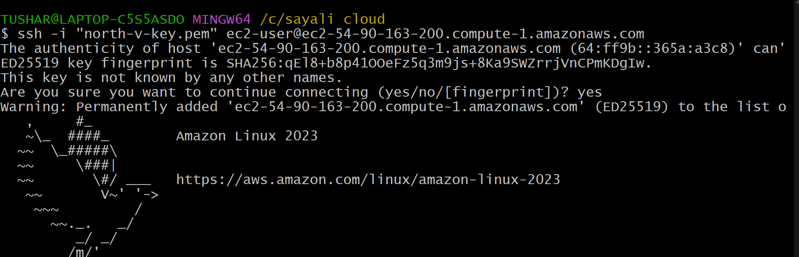
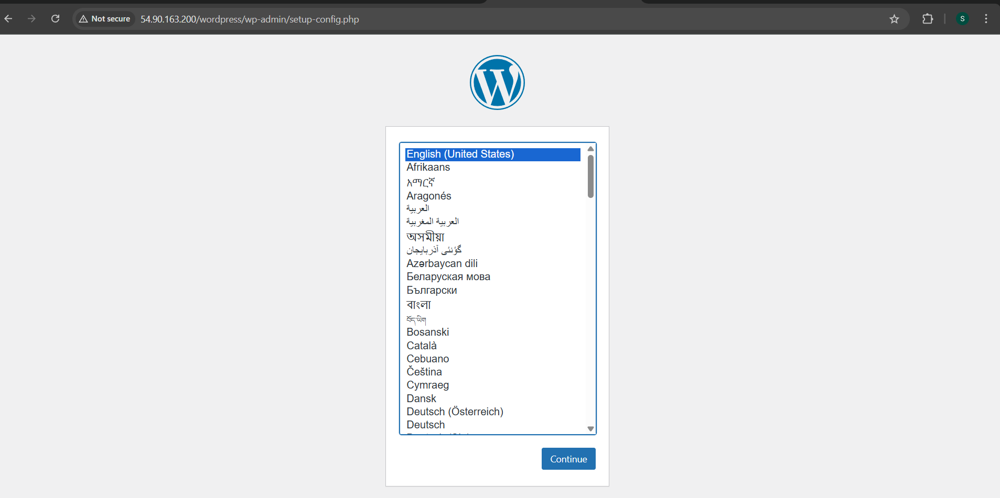
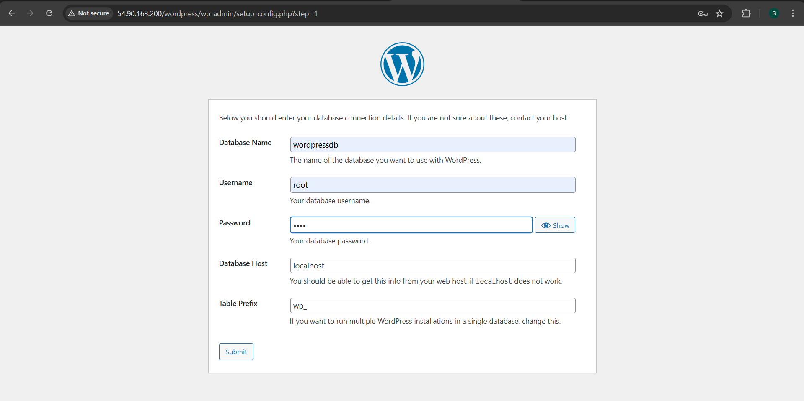
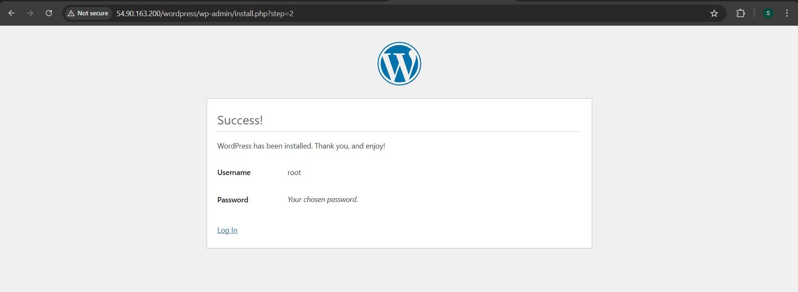

# Hosting Wordpress Step-by-Step 

## Introduction  

This project offers a detailed walkthrough for launching a WordPress website on a server with Apache as the web server and MariaDB as the database. It covers setting up the environment, installing necessary components, configuring WordPress, and completing the deployment to make the site accessible online. By following this guide, you can achieve a secure, scalable, and production-ready WordPress setup.

## Prerequisites

Before launching the WordPress website, confirm that the following are set up and operational:

* Linux Server – Amazon Linux operating system

* Web Server – Apache installed and actively running

* PHP – Including all necessary PHP extensions

* Database – MariaDB installed for managing WordPress data

## Step-by-Step Setup

### Step 1: Launch an EC2 Instance and Connect Securely via SSH

1. Launch EC2 Instance

2. Copy SSH Command

3. Paste it on Git bash terminal

### Step 2: Automating the Installation of the LAMP Stack on an AWS EC2 Instance

1. Create a lamp.sh file

   #sudo vim lamp.sh

2. Insert the script to install Apache, MySQL, and PHP on the system.

3. Open and run the file.

### Step 3: Downloading and Setting Up WordPress

1. Go to the html file
 
   #cd /var/www/html/

2. Download Wordpress

   #sudo wget https://wordpress.org/latest.tar.gz

3. Extract the archive

   #sudo tar -xvzf latest.tar.gz

### Step 4: Remove latest.tar.gz

#sudo rm -rf latest.tar.gz

### Step 5: Go to the wordpress folder

#cd wordpress/

### Step 6: Create a Database for WordPress

1. Create Username and Password

   #sudo mysql

   #alter user root@localhost identified by 'root';

2. Login to Mysql (mariadb 105-server)

   #sudo mysql -u root -p

3. Create & Show Database

   #create database wordpressdb;

   #show databases;

###  Step 7: Install Connector

     #sudo yum install php8.4-mysqlnd.x86_64

### Step 8: Change ownership of the files

    #sudo chown -R apache:apache wordpress/

 

          

###  Step 9: Copy the Public IP and Paste it in browser.   

1. Hit Pubilc IP on Browser

2. Click on continue

  

3. Click on Let's go

  

4. Fill all details and click on submit

  

5. Run the Installation

  

6. Fill up all information and click on install wordpress

 

7. Login to wordpress

 

8. Click on Login

 

9. Deployment of WordPress was successfull.

 

10. A new table was automatically inserted into the database.

 

## Project Summary

This project involves deploying a WordPress website on a Linux-based server using Apache as the web server and MariaDB as the database. It covers the complete setup process, including downloading WordPress, configuring file permissions, setting up the database, and optimizing the server for production. The result is a secure, scalable, and fully functional WordPress site accessible to the public.